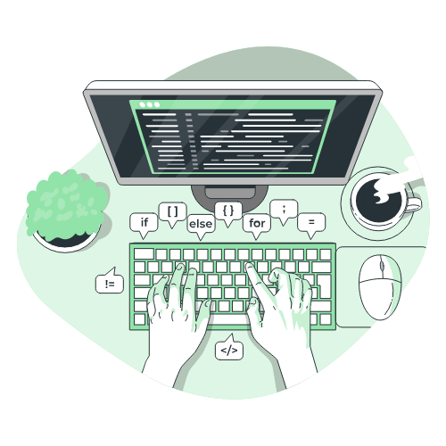

<div align = 'center'>

## Hi, I'm Nelson Eltz!


 </div>

<div >
<em align='center'>

[](https://www.linkedin.com/in/nelsoneltz/)
[](https://github.com/nelsoneltz)

</div>

---
---

<!-- <div >

</div> -->

<div ><em align = 'left'>

```python
first_name,last_name = 'Nelson', 'Eltz'
job,company = 'Data Analyst','PicPay'
code = ['Python','SQL','PySpark','HTML','CSS']
tools = ['Docker','Airflow','Databricks']
learning = ['Data Engineering','Javascript','Django', 'API''Mage']
on_going_projects = {
    "Discord Bot" : "Developing a Discord bot for a role-playing game called As Chaves da Torre",
    "FlexDuck" : "My friend wanderbatistaf is developing a modular ERP and I am helping as much as I can creating database connections and API",
    "Dev.to" : "Creating a blog for documenting my studies of data engineering"}
hobbies = [
    {"reading",
     "currently" :"The Fundamentals of Data Engineering"},
    {"music",
     "listening_to" : "King Gizzard & the Lizard Wizzard"}
]
```

</div>

---
 
---

<!--
**nelsoneltz/nelsoneltz** is a ✨ _special_ ✨ repository because its `README.md` (this file) appears on your GitHub profile.

Here are some ideas to get you started:

- 🔭 I’m currently working on ...
- 🌱 I’m currently learning ...
- 👯 I’m looking to collaborate on ...
- 🤔 I’m looking for help with ...
- 💬 Ask me about ...
- 📫 How to reach me: ...
- 😄 Pronouns: ...
- ⚡ Fun fact: ...
-->
